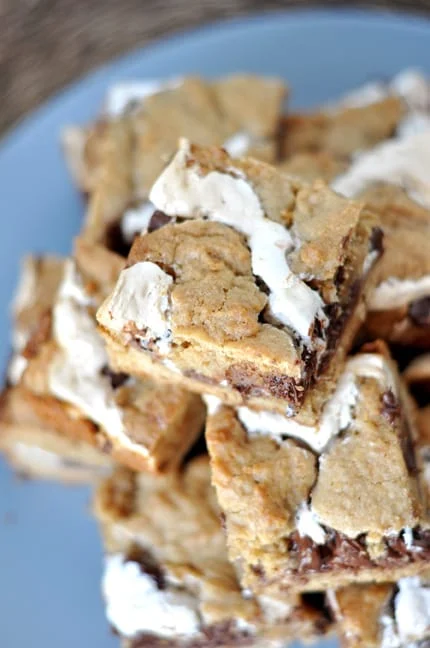

# S'mores Cookie Bars

> Mels kitchen s'mores bars [link](https://www.melskitchencafe.com/smores-cookie-bars/)

## Ingredients

- `2 cups` (284 g) all-purpose flour
- `2 cups` (200 g) crushed graham cracker crumbs
- `1 teaspoon` baking powder
- `1/4 teaspoon` salt
- `1 cup (227 g)` butter, softened to room temperature
- `1 1/2 cups` (318 g) packed light brown sugar
- `1 teaspoon` vanilla
- `2 large` eggs
- `2 cups` marshmallow topping, like Marshmallow Fluff or Creme
- `2 cups` (340 g) milk or semisweet chocolate chips

## Steps

1. Preheat the oven to **350 F**. Line a **9x13-inch pan** with foil, leaving a 2-inch overhang on the 2 short sides. Grease the foil with cooking spray and set aside.
2. In a medium bowl, combine the **flour**, **graham cracker crumbs**, **baking powder** and **salt**.
3. In a large bowl, using an electric mixer on medium speed, beat the **butter** and **sugar** until light, about **2 minutes**. Beat in the **eggs** and **vanilla** until well combined. Reduce the mixer speed to low and add the **flour mixture**, mixing until combined.
4. Divide the dough in half. Press half into the bottom of the prepared pan until the dough is evenly flattened. Dollop the **marshmallow topping** on top of the cookie base and gently spread into an even layer. Sprinkle the **chocolate chips** on top.
5. Scatter the remaining dough over the top in clumps. Don’t worry about completely covering the top, the marshmallow and chocolate chips should peek through.
6. Bake the bars until golden brown, about **30-32 minutes**. Cool completely. Remove the bars from the pan using the foil overhangs. Cut into bars and serve.